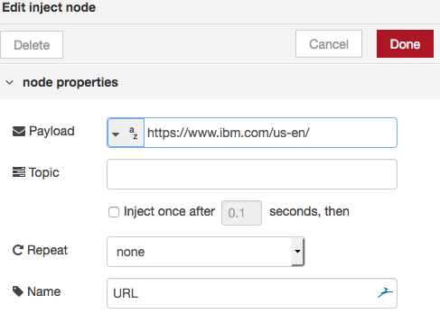
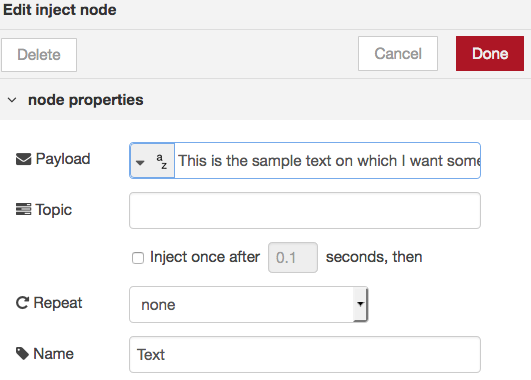
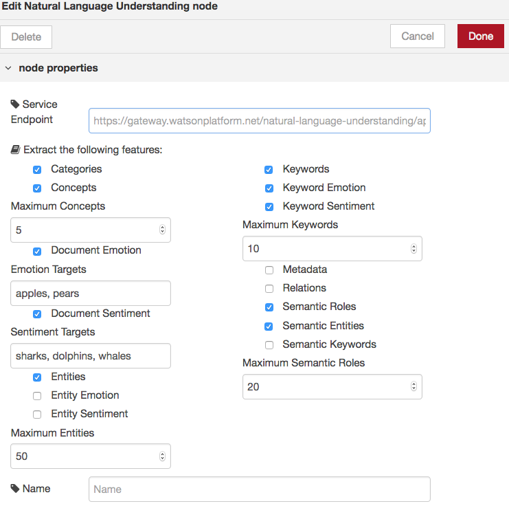
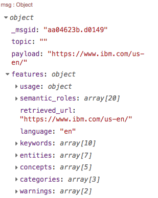

# Workshop 1 - Trying out an AI API using Node-RED

In this workshop you will get your first hands-on with a Natural Language Understanding API using Node-RED.

This workshop is made using IBM Cloud for simplicity, though if you feel more comfortable with an other platform, an other Natural Language service or if you want to run Node-RED on your machine, please do! 

## Before you begin

To complete this workshop you will need:
- A Node-Red instance
- A Natural Language Understanding service

**Creating a Node-RED app** (If you don't have one yet)

1. [Sign up for an account here](https://ibm.biz/BdYMsy)
2. Verify your account by clicking on the link in the email sent to you
3. Log in to your IBM Cloud account
4. Click on "Catalog" at the top
5. Search and select "Node-RED Starter" 
6. Give a unique name to your app and click "Create"

**Provisioning the NLU service**

1. Log in to your IBM Cloud account
2. Click on "Catalog" at the top
3. Search and select "Natural Language Understanding" 
4. Create the service

**Linking your Node-RED app and the NLU service**

1. Go back to your dashboard by clicking on the IBM Cloud logo
2. Click on the name of the app you've previously created
3. Click on "Connections" on the left-hand side
4. Click on "Create Connection"
5. Click "Connect" next to your NLU service and then "Restage"

## Building the Flow
Add the following nodes from the palette to your flow canvas.
*	Two Inject nodes.
*	A Natural Language Understanding node.
* A Debug node.

### Flow Wiring
Wire the nodes together like so:

### Node configuration

The first inject node will be used to inject a url into the flow. The example uses the standard IBM US site: [https://www.ibm.com/us-en/](https://www.ibm.com/us-en/)

The second inject node will be used to inject text into the flow. Any text can be used,  for example:
>	This is the sample text on which I want some understanding.

Configure the Natural Language Understanding node for the service features that you want to detect. As you select the items you require, the node menu will expand with additional options.

Configure the debug node to show the complete msg object.

### Trying your flow
Deploy the application and initiate both inject nodes. The output from the URL inject should look like:

and the output from the Text inject should look like:

From the debug tab, you can drill down into the keywords and categories etc.

## Flow Source
The complete flow is available [here](nlu_flow.json).

## Natural Language Understanding Documentation
To find more information on the Watson Natural Language Understanding underlying service, visit these webpages:
- [NLU Documentation](https://console.bluemix.net/docs/services/natural-language-understanding/index.html)
- [NLU API Documentation](https://www.ibm.com/watson/developercloud/natural-language-understanding/api/v1/)

