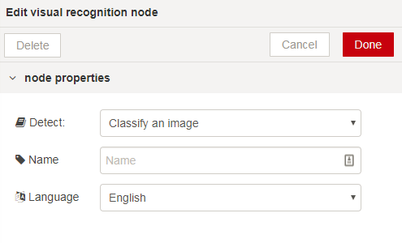
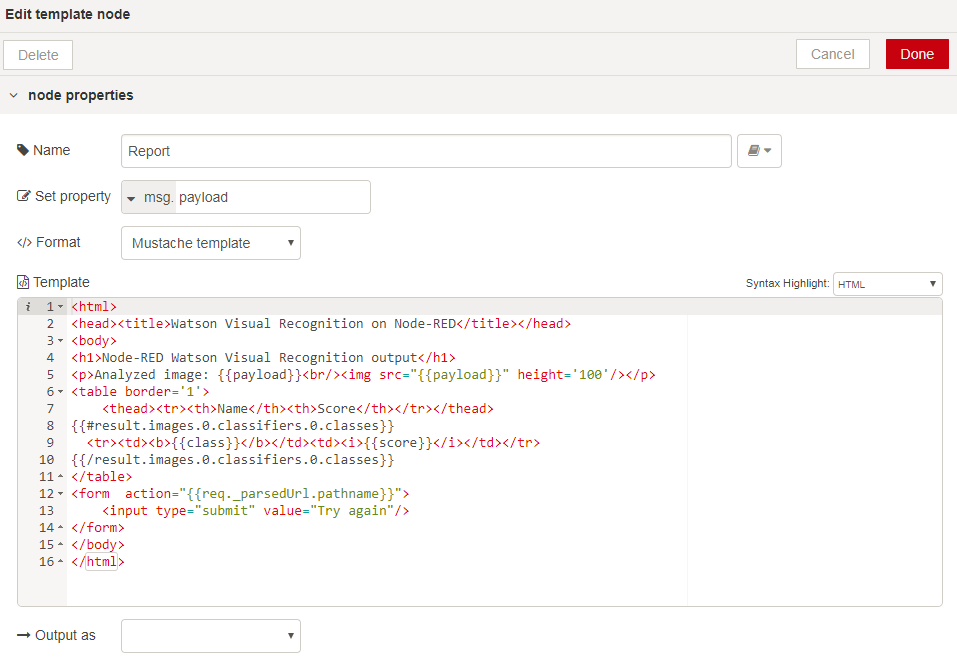

# Workshop 1 - Trying out an Image Recognition service using Node-RED

In this workshop you will get your first hands-on with an Image Recogntion API using Node-RED.

This workshop is made using IBM Cloud for simplicity, though if you feel more comfortable with an other platform, an other Image Recognition service or if you want to run Node-RED on your machine, please do! 

## Before you begin

To complete this workshop you will need:
- A Node-Red instance
- A Visual Recognition service

**Creating a Node-RED app**

1. [Sign up for an account here](https://ibm.biz/BdZHfN)
2. Verify your account by clicking on the link in the email sent to you
3. Log in to your IBM Cloud account
4. Click on "Catalog" on the top-right corner
5. Search and select "Node-RED Starter" 
6. Give a unique name to your app and click "Create"

**Provisioning the VR service**

1. Log in to your IBM Cloud account
2. Click on "Catalog" on the top-right corner
3. Search and select "Visual Recogition" 
4. Create the service

**Linking your Node-RED app and the VR service**

1. Go back to your dashboard by clicking on the IBM Cloud logo
2. Click on the name of the app you've previously created
3. Click on "Connections" on the left-hand side
4. Click on "Create Connection"
5. Click "Connect" next to your VR service and then "Restage"

### Building the flow
The flow will present a simple web page with a text field of where to input the image's URL, then submit it to Watson Visual Recognition. It will output the labels that have been found on the reply Web page.

The nodes required to build this flow are:

 - A  node, configured with a `/reco` URL
 - A  node which will test for the presence of the `imageurl` query parameter:
   
 - A first  node, configured to output an HTML input field and suggest a few selected images taken from the main Watson Visual Recognition demo web page:
```HTML
<html>
    <head>
        <title>Watson Visual Recognition on Node-RED</title>
    </head>
    <body>
    <h1>Welcome to the Watson Visual Recognition Demo on Node-RED</h1>
        <h2>Select an image URL</h2>
        <form  action="{{req._parsedUrl.pathname}}">
            
            
            
            
            <br/>Copy above image location URL or enter any image URL:<br/>
            <input type="text" name="imageurl"/>
            <input type="submit" value="Analyze"/>
        </form>
    </body>
</html>
```


- A  node (named `Extract img URL` here) to extract the `imageurl` query parameter from the web request and assign it to the payload to be provided as input to the Visual Recognition node:


 - The  node. Make sure that the credentials are setup from IBM Cloud, i.e. that the service is bound to the application. This can be verified by checking that the properties for the Visual Recognition node are clear:

 

 - And a final   node linked to the  output node. The template will format the output returned from the Visual Recognition node into an HTML table for easier reading:
```HTML
<html>
    <head><title>Watson Visual Recognition on Node-RED</title></head>
    <body>
        <h1>Node-RED Watson Visual Recognition output</h1>
        <p>Analyzed image: {{payload}}<br/></p>
        <table border='1'>
            <thead><tr><th>Name</th><th>Score</th></tr></thead>
        {{#result.images.0.classifiers.0.classes}}
        <tr><td><b>{{class}}</b></td><td><i>{{score}}</i></td></tr>
        {{/result.images.0.classifiers.0.classes}}
        </table>
        <form  action="{{req._parsedUrl.pathname}}">
            <input type="submit" value="Try again"/>
        </form>
    </body>
</html>
```
  
Note that the HTML snippet above has been simplified and stripped out of non-essential HTML tags, the completed flow solution has a complete HTML page.

### Testing the flow
To run the web page, point your browser to  `/http://xxxx.mybluemix.net/reco` and enter the URL of some  image.
The URL of the pre-selected images can be copied to clipboard and pasted into the text field.

The Watson Visual Recognition API will return an array with the recognized features, which will be formatted in a HTML table by the template:


### Flow source
The complete flow is available [here](reco_lab_web_page.json).

## Visual Recognition Documentation
To find more information on the Watson Visual Recognition underlying service, visit these webpages :
- [Visual Recognition Documentation](https://console.bluemix.net/docs/services/visual-recognition/index.html#about)
- [Visual Recognition API Documentation](https://www.ibm.com/watson/developercloud/visual-recognition/api/v3/)

